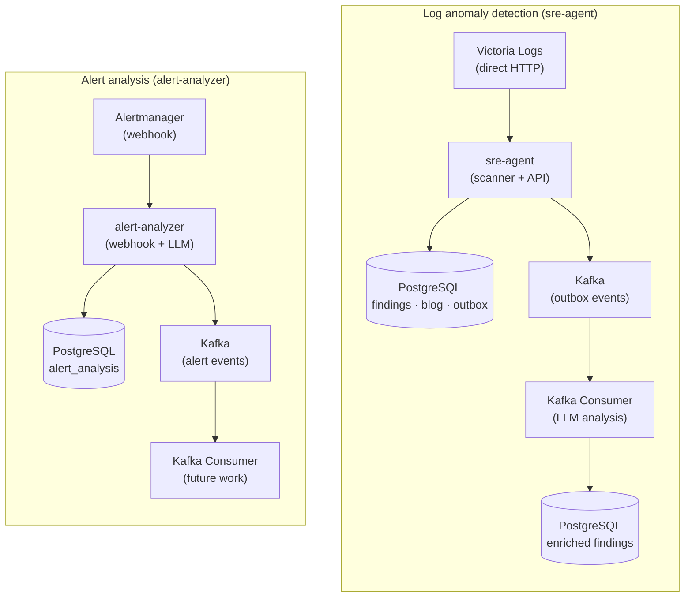

# Code Review Report — Auto SRE

**Date**: 2025-01-21  
**Reviewer**: AI Assistant  
**Scope**: Full codebase review (sre-agent, alert-analyzer, common modules)

---

## Executive Summary

The Auto SRE project is a well-structured anomaly detection system with LLM-powered analysis. The architecture uses:
- **PostgreSQL** for persistent storage (findings, blog posts, outbox events)
- **Kafka** for event streaming (findings, blog, scan events, alerts)
- **Victoria Logs** direct HTTP for log queries
- **LiteLLM** (OpenAI-compatible) for LLM analysis
- **Prometheus metrics** throughout with 100+ metric definitions

Two main services:
1. **sre-agent** (port 8096) — periodic log scanning + web UI
2. **alert-analyzer** (port 8097) — Alertmanager webhook consumer + LLM alert analysis

---

## Architecture Overview



---

## Detailed Findings

### ✅ Strengths

| Area | Observation |
|------|-------------|
| **Observability** | Excellent — 100+ Prometheus metrics covering scan, VL, LLM, Kafka, DB, HTTP, alerts |
| **Resilience** | Circuit breakers on VL and LLM clients with exponential backoff retry |
| **Delivery Guarantees** | Transactional outbox pattern ensures exactly-once delivery to Kafka |
| **Async Throughout** | Proper async/await with SQLAlchemy 2.0 async, aiokafka, httpx |
| **Graceful Shutdown** | Tracks background tasks, waits for completion, closes connections |
| **Security** | Basic Auth with configurable exclusions (health, metrics, static) |
| **Deduplication** | Time-window based dedup for both findings and alerts |
| **Metrics Cardinality** | HTTP path normalization prevents label explosion |
| **Configuration** | Environment-driven with sensible defaults |

---

### ⚠️ Critical Issues

#### 1. **Kafka Consumer — Creates New Agent Instance Per Worker** (`kafka_consumer.py:65-69`)
```python
self._agent = Agent(
    store=Store(),
    vl=build_vl_client(),
    llm=LlmClient(),
)
```
**Problem**: Each consumer worker creates its own DB pool, VL client, LLM client. Should reuse shared instances.

**Fix**: Pass shared `Store`, `LlmClient`, `HttpVlClient` instances to worker.

#### 2. **Outbox Poller Creates New Producer Each Cycle** (`kafka_producer.py:120-121`)
```python
producer = KafkaProducer()
await producer.start()
```
**Problem**: Creates new Kafka producer connection every 5 seconds. High overhead.

**Fix**: Reuse singleton producer or use connection pool.

#### 3. **Deduplication Race Condition** (`agent.py:302-316`)
```python
recent = await self.store.list_findings(limit=50)
for existing in recent:
    # check and return early
finding_id = await self.store.add_finding_with_outbox(...)
```
**Problem**: Between `list_findings` and `add_finding_with_outbox`, another scan could insert same finding.

**Fix**: Add unique constraint on `(service, created_at)` or use DB-level upsert with `ON CONFLICT`.

#### 4. **Alert Deduplication Inefficient** (`analyzer.py:155-167`)
```python
analyses = await self.store.list_analyses(limit=100, since=since)
for a in analyses:
    correlated = json.loads(a.get("correlated_group", "[]"))
    if fingerprint in correlated:
        return True
```
**Problem**: Fetches 100 rows, deserializes JSON for each. No DB index on `correlated_group`.

**Fix**: Add separate table `alert_dedup(fingerprint, created_at)` with unique index.

#### 5. **Missing Error Handling for LLM JSON Parse** (`llm_client.py:179-188`)
```python
def extract_json(text: str) -> dict:
    match = re.search(r"\{.*\}", text, re.DOTALL)
    if not match:
        return {}
```
**Problem**: Returns empty dict on parse failure — downstream code assumes valid keys exist.

**Fix**: Raise exception or return structured error result.

#### 6. **Hardcoded LLM Model in Metrics** (`agent.py:191-194`)
```python
scan_findings_created.labels(severity=severity).inc()
findings_created_total.labels(severity=severity, service=service).inc()
```
Uses `agent.llm.model` but metrics don't track model version. Can't correlate quality with model changes.

---

### 🔧 Major Improvements Needed

#### 7. **No Health Checks for Dependencies** (`app.py:295-309`)
`/api/health` only checks DB queries. Doesn't verify:
- Victoria Logs connectivity
- Kafka connectivity
- LLM endpoint availability

#### 8. **No Request Timeout on VL/LLM Calls**
- `vl.py`: `httpx.Timeout(60)` but no per-request deadline enforcement
- `llm_client.py`: `timeout=180` on client but no request-level timeout

#### 9. **Kafka Consumer No Dead Letter Queue**
Failed messages are logged but not persisted for reprocessing. After max retries, message is lost.

#### 10. **Outbox Retry Logic Incomplete** (`kafka_producer.py:129-133`)
```python
event.retry_count += 1
event.last_error = str(exc)
```
No max retry limit, no exponential backoff, no dead letter handling.

#### 11. **Alert Batcher No Persistence**
In-memory buffer (`AlertBatcher._buffer`) — restarts lose pending alerts.

#### 12. **No Database Migration Strategy**
Uses `Base.metadata.create_all()` on startup. No alembic migrations for schema changes.

---

### 📝 Code Quality Issues

| File | Line | Issue |
|------|------|-------|
| `store.py` | 110 | `_to_dict` uses `row.__table__.columns` — breaks with hybrid properties |
| `agent.py` | 307-311 | `datetime.fromisoformat` on potentially non-ISO strings |
| `kafka_consumer.py` | 150-153 | Dynamic import `from store import Finding` inside function |
| `app.py` | 181-184 | Path normalization only for `/api/findings/{id}` — other paths need similar |
| `analyzer.py` | 205 | `complete_json` can return `{}` on parse failure — no validation |
| `vl.py` | 73-74 | `asyncio` imported at bottom of file (style) |
| `llm_client.py` | 191 | `asyncio` imported at bottom (style) |

---

### 🧪 Testing Gaps

| Component | Status |
|-----------|--------|
| Unit tests | ❌ None |
| Integration tests | ❌ None |
| Contract tests (Kafka schemas) | ❌ None |
| Load tests | ❌ None |
| Chaos tests | ❌ None |

---

### 🔒 Security Considerations

| Area | Status | Notes |
|------|--------|-------|
| Basic Auth | ✅ Implemented | But credentials in env vars (consider Vault) |
| TLS for Kafka | ❌ Not configured | PLAINTEXT only in compose |
| TLS for PostgreSQL | ❌ Not configured | |
| TLS for Victoria Logs | ⚠️ Depends on VL_URL | |
| Secrets in logs | ⚠️ Possible | `log_requests` middleware logs body |
| SQL Injection | ✅ Protected | SQLAlchemy ORM used |
| XSS in Web UI | ⚠️ Possible | Jinja2 autoescape but markdown filter |

---

## Recommended Action Plan

### Priority 1 (Before Production)
1. Fix deduplication race condition (DB constraint)
2. Add Kafka DLQ for failed messages
3. Implement persistent alert batching (Redis or DB)
4. Add dependency health checks to `/api/health`
5. Configure Kafka/PostgreSQL TLS

### Priority 2 (Short Term)
1. Reuse shared clients in Kafka consumer
2. Add max retries + backoff to outbox processor
3. Implement DB migration strategy (alembic)
4. Add request timeouts for VL/LLM calls
5. Fix LLM JSON parse error handling

### Priority 3 (Technical Debt)
1. Add unit/integration tests
2. Move dynamic imports to module level
3. Add path normalization for all metric endpoints
4. Add LLM model version to metrics
5. Sanitize request body logging

---

## File-by-File Summary

| File | Lines | Status | Key Concerns |
|------|-------|--------|--------------|
| `sre-agent/app.py` | 310 | ✅ Good | Middleware order, auth bypass for metrics |
| `sre-agent/agent.py` | 417 | ⚠️ Needs fixes | Race condition, error handling |
| `sre-agent/store.py` | 282 | ✅ Good | Pool metrics, transactional outbox |
| `sre-agent/kafka_producer.py` | 159 | ⚠️ Fix needed | New producer per poll |
| `sre-agent/kafka_consumer.py` | 274 | ⚠️ Fix needed | New agent per worker |
| `sre-agent/vl.py` | ~200 | ✅ Good | Circuit breaker, retry |
| `sre-agent/llm.py` | 191 | ⚠️ Needs fix | JSON parse error handling |
| `sre-agent/metrics.py` | 300+ | ✅ Excellent | Comprehensive |
| `alert-analyzer/app.py` | 184 | ✅ Good | Auth, metrics, webhook |
| `alert-analyzer/analyzer.py` | 273 | ⚠️ Fix needed | In-memory batcher, dedup |
| `alert-analyzer/models.py` | ~100 | ✅ Good | Pydantic validation |
| `alert-analyzer/store.py` | ~200 | ✅ Good | Async SQLAlchemy |
| `common/llm_client.py` | 191 | ✅ Good | Shared, retry, metrics |

---

## Metrics Coverage Summary

| Category | Metrics | Coverage |
|----------|---------|----------|
| Scan | 9 | ✅ |
| Findings | 5 | ✅ |
| Victoria Logs | 4 | ✅ |
| LLM | 7 | ✅ |
| Kafka | 8 | ✅ |
| Database | 4 | ✅ |
| Blog | 4 | ✅ |
| HTTP | 3 | ✅ |
| Alerts | 7 | ✅ |
| System | 2 | ✅ |
| **Total** | **53+** | **Excellent** |

---

## Next Steps

1. **Create GitHub issues** for each Priority 1 item
2. **Set up CI/CD** with linting (ruff), type checking (mypy), tests
3. **Add pre-commit hooks** for code quality
4. **Document deployment** (Ansible playbooks, secrets management)
5. **Run integration tests** with testcontainers for PostgreSQL/Kafka