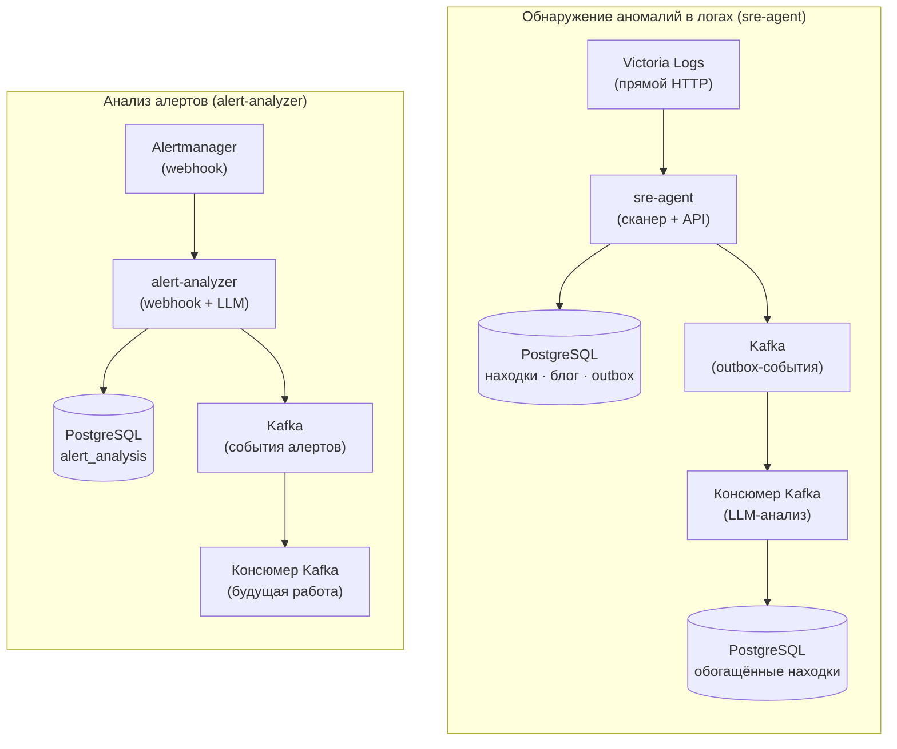

# Отчёт о ревью кода — Auto SRE

**Дата**: 2025-01-21  
**Ревьюер**: AI-ассистент  
**Объём**: полное ревью кодовой базы (sre-agent, alert-analyzer, общие модули)

---

## Краткое резюме

Проект Auto SRE — хорошо структурированная система обнаружения аномалий с анализом на базе LLM. Архитектура использует:
- **PostgreSQL** для постоянного хранения (находки, посты блога, outbox-события)
- **Kafka** для потоковой передачи событий (находки, блог, события сканов, алерты)
- **Victoria Logs** — прямой HTTP для запросов к логам
- **LiteLLM** (OpenAI-совместимый) для LLM-анализа
- **Метрики Prometheus** по всему проекту, 100+ определений метрик

Два основных сервиса:
1. **sre-agent** (порт 8096) — периодический скан логов + веб-UI
2. **alert-analyzer** (порт 8097) — приём webhook'ов Alertmanager + LLM-анализ алертов

---

## Обзор архитектуры



---

## Детальные замечания

### ✅ Сильные стороны

| Область | Наблюдение |
|------|-------------|
| **Наблюдаемость** | Отлично — 100+ метрик Prometheus, покрывающих скан, VL, LLM, Kafka, БД, HTTP, алерты |
| **Устойчивость** | Circuit breaker в клиентах VL и LLM с повторами и экспоненциальным backoff |
| **Гарантии доставки** | Паттерн transactional outbox обеспечивает доставку в Kafka ровно один раз (exactly-once) |
| **Асинхронность** | Корректный async/await с SQLAlchemy 2.0 async, aiokafka, httpx |
| **Корректное завершение работы** | Отслеживает фоновые задачи, дожидается их завершения, закрывает соединения |
| **Безопасность** | Basic Auth с настраиваемыми исключениями (health, metrics, static) |
| **Дедупликация** | Дедупликация по временному окну как для находок, так и для алертов |
| **Кардинальность метрик** | Нормализация HTTP-путей предотвращает взрывной рост лейблов |
| **Конфигурация** | Через переменные окружения с разумными значениями по умолчанию |

---

### ⚠️ Критичные проблемы

#### 1. **Kafka Consumer — создаёт новый экземпляр Agent на каждого воркера** (`kafka_consumer.py:65-69`)
```python
self._agent = Agent(
    store=Store(),
    vl=build_vl_client(),
    llm=LlmClient(),
)
```
**Проблема**: Каждый воркер консюмера создаёт собственный пул соединений с БД, клиент VL, клиент LLM. Следует переиспользовать общие экземпляры.

**Исправление**: Передавать воркеру общие экземпляры `Store`, `LlmClient`, `HttpVlClient`.

#### 2. **Outbox-поллер создаёт нового продюсера на каждом цикле** (`kafka_producer.py:120-121`)
```python
producer = KafkaProducer()
await producer.start()
```
**Проблема**: Новое соединение продюсера Kafka создаётся каждые 5 секунд. Высокие накладные расходы.

**Исправление**: Переиспользовать singleton-продюсер или использовать пул соединений.

#### 3. **Гонка при дедупликации** (`agent.py:302-316`)
```python
recent = await self.store.list_findings(limit=50)
for existing in recent:
    # проверка и ранний выход
finding_id = await self.store.add_finding_with_outbox(...)
```
**Проблема**: Между `list_findings` и `add_finding_with_outbox` другой скан может вставить ту же находку.

**Исправление**: Добавить уникальный constraint на `(service, created_at)` или использовать upsert на уровне БД с `ON CONFLICT`.

#### 4. **Неэффективная дедупликация алертов** (`analyzer.py:155-167`)
```python
analyses = await self.store.list_analyses(limit=100, since=since)
for a in analyses:
    correlated = json.loads(a.get("correlated_group", "[]"))
    if fingerprint in correlated:
        return True
```
**Проблема**: Загружает 100 строк и десериализует JSON для каждой. В БД нет индекса по `correlated_group`.

**Исправление**: Добавить отдельную таблицу `alert_dedup(fingerprint, created_at)` с уникальным индексом.

#### 5. **Отсутствует обработка ошибок парсинга JSON от LLM** (`llm_client.py:179-188`)
```python
def extract_json(text: str) -> dict:
    match = re.search(r"\{.*\}", text, re.DOTALL)
    if not match:
        return {}
```
**Проблема**: Возвращает пустой dict при ошибке парсинга — код ниже рассчитывает на наличие валидных ключей.

**Исправление**: Бросать исключение или возвращать структурированный результат с ошибкой.

#### 6. **Захардкоженная модель LLM в метриках** (`agent.py:191-194`)
```python
scan_findings_created.labels(severity=severity).inc()
findings_created_total.labels(severity=severity, service=service).inc()
```
Используется `agent.llm.model`, но метрики не отслеживают версию модели. Невозможно сопоставить качество с изменениями модели.

---

### 🔧 Требуемые существенные улучшения

#### 7. **Нет health-check зависимостей** (`app.py:295-309`)
`/api/health` проверяет только запросы к БД. Не проверяет:
- доступность Victoria Logs
- доступность Kafka
- доступность эндпоинта LLM

#### 8. **Нет таймаута запросов к VL/LLM**
- `vl.py`: есть `httpx.Timeout(60)`, но нет контроля дедлайна на уровне отдельного запроса
- `llm_client.py`: `timeout=180` на клиенте, но нет таймаута уровня запроса

#### 9. **У консюмера Kafka нет Dead Letter Queue**
Ошибочные сообщения логируются, но не сохраняются для повторной обработки. После исчерпания попыток сообщение теряется.

#### 10. **Неполная логика повторов в outbox** (`kafka_producer.py:129-133`)
```python
event.retry_count += 1
event.last_error = str(exc)
```
Нет лимита повторов, нет экспоненциального backoff, нет dead-letter обработки.

#### 11. **Батчер алертов без персистентности**
Буфер в памяти (`AlertBatcher._buffer`) — при перезапуске ожидающие алерты теряются.

#### 12. **Нет стратегии миграций БД**
При старте используется `Base.metadata.create_all()`. Нет alembic-миграций для изменений схемы.

---

### 📝 Проблемы качества кода

| Файл | Строки | Замечание |
|------|-------|-------|
| `store.py` | 110 | `_to_dict` использует `row.__table__.columns` — ломается на hybrid properties |
| `agent.py` | 307-311 | `datetime.fromisoformat` на потенциально не-ISO строках |
| `kafka_consumer.py` | 150-153 | Динамический импорт `from store import Finding` внутри функции |
| `app.py` | 181-184 | Нормализация путей только для `/api/findings/{id}` — остальным путям нужно то же самое |
| `analyzer.py` | 205 | `complete_json` может вернуть `{}` при ошибке парсинга — нет валидации |
| `vl.py` | 73-74 | `asyncio` импортирован в конце файла (стиль) |
| `llm_client.py` | 191 | `asyncio` импортирован в конце файла (стиль) |

---

### 🧪 Пробелы в тестировании

| Компонент | Статус |
|-----------|--------|
| Юнит-тесты | ❌ Отсутствуют |
| Интеграционные тесты | ❌ Отсутствуют |
| Контрактные тесты (схемы Kafka) | ❌ Отсутствуют |
| Нагрузочные тесты | ❌ Отсутствуют |
| Хаос-тесты | ❌ Отсутствуют |

---

### 🔒 Соображения безопасности

| Область | Статус | Примечания |
|------|--------|--------|
| Basic Auth | ✅ Реализовано | Но учётные данные в переменных окружения (стоит рассмотреть Vault) |
| TLS для Kafka | ❌ Не настроено | Только PLAINTEXT в compose |
| TLS для PostgreSQL | ❌ Не настроено | |
| TLS для Victoria Logs | ⚠️ Зависит от VL_URL | |
| Секреты в логах | ⚠️ Возможно | Middleware `log_requests` логирует тело запроса |
| SQL-инъекции | ✅ Защищено | Используется ORM SQLAlchemy |
| XSS в веб-UI | ⚠️ Возможно | Autoescape в Jinja2, но есть markdown-фильтр |

---

## Рекомендуемый план действий

### Приоритет 1 (до production)
1. Исправить гонку при дедупликации (constraint на уровне БД)
2. Добавить DLQ в Kafka для ошибочных сообщений
3. Реализовать персистентную батч-обработку алертов (Redis или БД)
4. Добавить health-check зависимостей в `/api/health`
5. Настроить TLS для Kafka/PostgreSQL

### Приоритет 2 (краткосрочно)
1. Переиспользовать общие клиенты в консюмере Kafka
2. Добавить лимит повторов + backoff в обработчик outbox
3. Внедрить стратегию миграций БД (alembic)
4. Добавить таймауты запросов к VL/LLM
5. Исправить обработку ошибок парсинга JSON от LLM

### Приоритет 3 (технический долг)
1. Добавить юнит-/интеграционные тесты
2. Перенести динамические импорты на уровень модуля
3. Добавить нормализацию путей для всех эндпоинтов метрик
4. Добавить версию модели LLM в метрики
5. Санитизировать логирование тела запросов

---

## Сводка по файлам

| Файл | Строки | Статус | Основные проблемы |
|------|-------|--------|--------------|
| `sre-agent/app.py` | 310 | ✅ Хорошо | порядок middleware, обход auth для metrics |
| `sre-agent/agent.py` | 417 | ⚠️ Нужны исправления | гонка, обработка ошибок |
| `sre-agent/store.py` | 282 | ✅ Хорошо | метрики пула, transactional outbox |
| `sre-agent/kafka_producer.py` | 159 | ⚠️ Нужно исправить | новый продюсер на каждый опрос |
| `sre-agent/kafka_consumer.py` | 274 | ⚠️ Нужно исправить | новый Agent на каждого воркера |
| `sre-agent/vl.py` | ~200 | ✅ Хорошо | circuit breaker, повторы |
| `sre-agent/llm.py` | 191 | ⚠️ Нужно исправить | обработка ошибок парсинга JSON |
| `sre-agent/metrics.py` | 300+ | ✅ Отлично | исчерпывающе |
| `alert-analyzer/app.py` | 184 | ✅ Хорошо | auth, метрики, webhook |
| `alert-analyzer/analyzer.py` | 273 | ⚠️ Нужно исправить | батчер в памяти, дедупликация |
| `alert-analyzer/models.py` | ~100 | ✅ Хорошо | Pydantic-валидация |
| `alert-analyzer/store.py` | ~200 | ✅ Хорошо | асинхронный SQLAlchemy |
| `common/llm_client.py` | 191 | ✅ Хорошо | общий, повторы, метрики |

---

## Сводка покрытия метриками

| Категория | Метрик | Покрытие |
|----------|---------|----------|
| Скан | 9 | ✅ |
| Находки | 5 | ✅ |
| Victoria Logs | 4 | ✅ |
| LLM | 7 | ✅ |
| Kafka | 8 | ✅ |
| База данных | 4 | ✅ |
| Блог | 4 | ✅ |
| HTTP | 3 | ✅ |
| Алерты | 7 | ✅ |
| Система | 2 | ✅ |
| **Итого** | **53+** | **Отлично** |

---

## Следующие шаги

1. **Создать GitHub issues** по каждому пункту Приоритета 1
2. **Настроить CI/CD** с линтингом (ruff), проверкой типов (mypy), тестами
3. **Добавить pre-commit hooks** для контроля качества кода
4. **Задокументировать деплой** (Ansible playbook'и, управление секретами)
5. **Запустить интеграционные тесты** с testcontainers для PostgreSQL/Kafka
